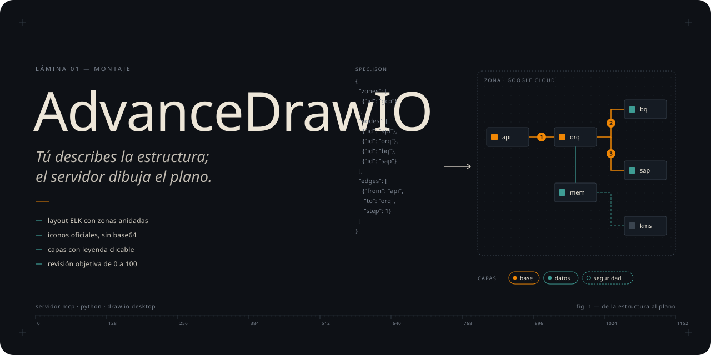

<p align="center">
  
</p>

<h1 align="center">AdvanceDrawIO</h1>

<p align="center">
  Un servidor MCP que convierte la descripción de un sistema en un diagrama draw.io de arquitectura listo para mostrar.<br>
  <i>El modelo escribe la estructura en JSON; el servidor pone el layout, los iconos oficiales, las capas y la revisión.</i>
</p>

<p align="center">
  <a href="https://github.com/Leonsang/AdvanceDrawIO/actions/workflows/ci.yml"></a>
  <a href="docs/galeria/README.md"></a>
  
  
  
  
</p>

---

Los modelos de lenguaje entienden bien una arquitectura y la dibujan mal: inventan coordenadas,
enciman cajas, escriben iconos en base64 que no existen y entregan un diagrama que nadie puede
editar. AdvanceDrawIO separa las dos cosas. El modelo solo describe **qué hay y cómo se conecta**, y
el servidor hace todo lo demás:

- **Layout automático con ELK**, el motor de draw.io Desktop, con zonas anidadas. Nunca hay coordenadas en el spec.
- **Iconos oficiales** de un índice de ~10.000 shapes de draw.io, más tus propios SVG. Nunca hay base64.
- **Capas reales** por flujo, visibles u ocultas, con una **leyenda clicable** que las muestra y oculta.
- **Pasos numerados**, **notas** en su propia capa y título.
- **Revisión objetiva de 0 a 100** y el PNG del resultado, para que el modelo mire lo que dibujó y lo corrija.
- **Los 770 ejemplos oficiales de jgraph como referencia**, con tres modos de construcción: spec, Mermaid y plantilla.

> [!IMPORTANT]
> AdvanceDrawIO usa el CLI de **[draw.io Desktop](https://get.diagrams.net)** para el layout y el
> export, así que tiene que estar instalado en la máquina donde corre el servidor. En Linux sin
> pantalla también hace falta `xvfb`. La tool `doctor` te dice si lo encuentra.

## Cómo funciona

<p align="center">
  
</p>

1. Le pides a tu herramienta de IA un diagrama. El agente `drawio-architect` busca ejemplos del
   mismo tipo entre los 770 de jgraph y copia sus estilos en vez de inventarlos.
2. Escribe un spec JSON con zonas, nodos, edges y capas, y llama `build_diagram`.
3. El servidor valida el spec, crea un borrador, le pide a draw.io el layout ELK, restaura tamaños,
   mueve cada edge a su capa y agrega leyenda, notas y título.
4. Devuelve el `.drawio` editable, el PNG y la **revisión**. Si el puntaje no llega a 85 o el PNG se
   ve mal, el agente cambia una cosa del spec y vuelve a construir.

Este diagrama también lo dibujó AdvanceDrawIO, a partir de [`examples/como-funciona.json`](examples/como-funciona.json).

## Instalación

```bash
pip install git+https://github.com/Leonsang/AdvanceDrawIO.git
advancedrawio-build --search bigquery      # prueba: busca iconos (descarga el índice la primera vez)
```

La primera ejecución descarga el índice de iconos (~5 MB) y lo guarda en `~/.cache/advancedrawio`.

**Claude Code**

```bash
claude mcp add advancedrawio -e ADVANCEDRAWIO_OUT=$HOME/diagramas -- advancedrawio
```

Si clonas el repo, también tienes el subagente `drawio-architect` en `.claude/agents/`.

**Claude Desktop, Cursor y otros clientes MCP** (`claude_desktop_config.json`, `.cursor/mcp.json`…)

```json
{
  "mcpServers": {
    "advancedrawio": {
      "command": "advancedrawio",
      "env": { "ADVANCEDRAWIO_OUT": "/ruta/a/diagramas" }
    }
  }
}
```

Si `advancedrawio` no está en el PATH, usa la ruta completa: `.venv\Scripts\advancedrawio.exe` en
Windows o `.venv/bin/advancedrawio` en macOS y Linux. Después pide *"usa doctor"* para verificar
que encuentra draw.io y los iconos.

## Inicio rápido

En tu herramienta de IA:

> Dibuja en draw.io la arquitectura de una API de pedidos serverless en AWS: API Gateway con Cognito,
> una Lambda que guarda en DynamoDB y publica un evento, y una cola que dispara la facturación a S3.
> Seguridad y observabilidad en capas aparte.

Sin IA, desde la terminal, con los mismos tres modos:

```bash
advancedrawio-build examples/aws-serverless.json -o diagramas            # modo spec
advancedrawio-build examples/modelo-recaudo.mmd -f png svg                # modo Mermaid
advancedrawio-build examples/dofa-app-pagos.plantilla.json                # modo plantilla
advancedrawio-build examples/multiagente-gcp.json --min-score 85          # falla si la revisión no pasa
```

Cada comando imprime las rutas generadas y la revisión.

## Galería

Todos estos diagramas salen tal cual de [`examples/`](examples). El CI los reconstruye con draw.io
real en cada cambio y los publica en [`docs/galeria`](docs/galeria/README.md), con su puntaje y un
enlace para abrirlos en draw.io.

| API serverless · AWS | Asistente multiagente · GCP |
|---|---|
| [](examples/aws-serverless.json) | [](examples/multiagente-gcp.json) |
| **Plataforma de datos de recaudo** | **Plataforma de IA conversacional · GCP** |
| [](examples/plataforma-recaudo.json) | [](examples/plataforma-ia-gcp.json) |
| **Contexto C4** | **Modelo ER (Mermaid)** |
| [](examples/contexto-c4.json) | [](examples/modelo-recaudo.mmd) |

## Tres modos, según el tipo de diagrama

| Modo | Para | Tool | Ejemplo |
|---|---|---|---|
| **spec** | Arquitectura cloud, redes, flujos, C4, pipelines | `build_diagram` | [aws-serverless.json](examples/aws-serverless.json) |
| **mermaid** | ER, secuencia, clases, estados, gantt, mindmap, git | `build_from_mermaid` | [modelo-recaudo.mmd](examples/modelo-recaudo.mmd) |
| **plantilla** | Planos, infografías, wireframes, DOFA y canvas, eléctricos | `build_from_example` | [dofa-app-pagos.plantilla.json](examples/dofa-app-pagos.plantilla.json) |

<p align="center">
  
</p>

En modo plantilla, el valor está en el diseño del ejemplo oficial: el servidor lo copia y reemplaza
sus textos conservando el formato.

## Tools

| Tool | Para qué |
|---|---|
| `find_examples(tipo, query, patron, libreria)` | Buscar entre los 770 ejemplos de jgraph. Sin argumentos, lista los 23 tipos |
| `get_example(id)` | Receta de estilos por rol, capas, textos reemplazables e imagen del ejemplo |
| `search_icons(query)` | Iconos GCP (imagen), para el campo `product` |
| `search_shapes(query)` | Stencils oficiales (AWS, Azure, Cisco, Kubernetes, BPMN…), para el campo `style` |
| `build_diagram(spec)` | Modo spec: layout ELK, capas, leyenda, revisión y PNG |
| `build_from_mermaid(code)` | Modo Mermaid: shapes nativos y editables |
| `build_from_example(id, replacements)` | Modo plantilla: copia el ejemplo y reemplaza textos conservando el formato |
| `lint_diagram(path)` | [Revisión objetiva](docs/revision.md) de cualquier `.drawio` |
| `render(path)` | Ver un `.drawio` existente como PNG |
| `spec_reference()` / `doctor()` | Formato del spec / diagnóstico de la instalación |

El servidor también expone el prompt MCP **`arquitecto_drawio`**, con el mismo proceso que el subagente.

## El agente

[`drawio-architect`](.claude/agents/drawio-architect.md) (subagente de Claude Code y prompt MCP
`arquitecto_drawio`) sigue siempre el mismo proceso:

1. **Busca ejemplos** del tipo pedido y elige el modo que indica el catálogo.
2. **Diseña el spec** con reglas fijas: una zona por frontera real, `label` para la función y
   `product` para el servicio, el flujo principal numerado y lo secundario en capas ocultas.
3. **Construye, lee la revisión y mira el PNG.** Cambia una sola cosa por iteración, con un máximo
   de 4, y vuelve a la mejor versión si una iteración empeora.
4. **Entrega** las rutas, el puntaje, qué muestra cada capa y lo que no pudo resolver.

El playbook que usa para cada problema de la revisión está en [`agent.md`](src/advancedrawio/agent.md).

## Spec

```json
{
  "title": "Ingesta de pagos",
  "direction": "RIGHT",
  "layers": [{"id": "obs", "name": "Observabilidad", "visible": false}],
  "zones":  [{"id": "gcp", "label": "Google Cloud", "kind": "cloud"},
             {"id": "erp", "label": "ERP", "kind": "external"}],
  "nodes":  [{"id": "sap", "label": "SAP FI-CA", "kind": "database", "zone": "erp"},
             {"id": "ps",  "label": "Ingesta", "product": "Pub Sub", "zone": "gcp"},
             {"id": "bq",  "label": "Warehouse", "product": "BigQuery", "zone": "gcp"},
             {"id": "mon", "label": "Alertas", "product": "Cloud Monitoring", "zone": "gcp"}],
  "edges":  [{"from": "sap", "to": "ps", "step": 1, "label": "CDC"},
             {"from": "ps", "to": "bq", "step": 2},
             {"from": "bq", "to": "mon", "layer": "obs", "dashed": true}],
  "notes":  [{"text": "Particionado por día", "near": "bq"}]
}
```

- **Zonas**: `cloud` (bloque del proveedor), `zone` (capa lógica), `external` (fuera de la nube) y `plain`. Se anidan con `parent`.
- **Nodos**: `card` (tarjeta con icono, por defecto), `box`, `actor` y `database`, o cualquier `style` de draw.io.
- **Edges**: sin `layer` van a la capa Base. `step` pinta un badge numerado; también admiten `dashed` y `bidirectional`.
- **Capas**: con `visible: false` arrancan ocultas y se activan desde la leyenda (Ctrl/Cmd + clic en el editor; clic en el visor).

La referencia completa, campo por campo, está en [docs/spec.md](docs/spec.md).

## Iconos propios

El índice de draw.io no trae algunos iconos recientes, como **Vertex AI** o **Gemini**. Pon los SVG
en `icons/` (por ejemplo `icons/vertex-ai.svg`) o en la carpeta que indique `ADVANCEDRAWIO_ICONS`, y
úsalos con `"product": "vertex ai"`. Tienen prioridad sobre el índice.

## Variables de entorno

| Variable | Default |
|---|---|
| `ADVANCEDRAWIO_OUT` | `./diagramas` |
| `DRAWIO_BIN` | Autodetecta en PATH, macOS, Windows y WSL |
| `ADVANCEDRAWIO_ICONS` | `./icons` |
| `ADVANCEDRAWIO_CACHE` | `~/.cache/advancedrawio` |

## Limitaciones conocidas

- ELK optimiza el flujo, no la estética. En arquitecturas con muchos cruces entre zonas suele hacer falta un retoque manual de 1 o 2 minutos.
- Por encima de ~25 nodos conviene partir el sistema en una vista general y diagramas de detalle.
- No uses `--layout libavoid` en modo headless: se cuelga.
- Un puntaje de 100 no garantiza un buen diagrama. Lo que la revisión no ve está en [docs/revision.md](docs/revision.md).

## Documentación

- [Referencia del spec](docs/spec.md)
- [Revisión objetiva](docs/revision.md)
- [Galería](docs/galeria/README.md)
- [Sesiones en la nube de Claude Code](docs/cloud.md)
- [Cómo contribuir](CONTRIBUTING.md)
- [Notas de versión](release-notes)

## Licencia

[MIT](LICENSE). Las fuentes del banner (Instrument Serif y Geist Mono) tienen licencia OFL y están
en [`media/fonts`](media/fonts). Los ejemplos del catálogo pertenecen a
[jgraph](https://github.com/jgraph/drawio-diagrams) y se descargan bajo demanda.
