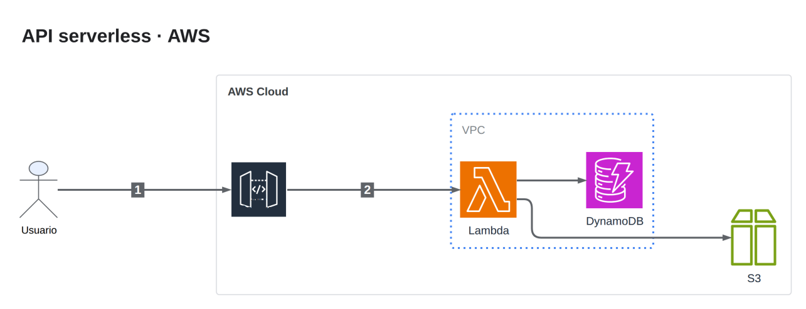
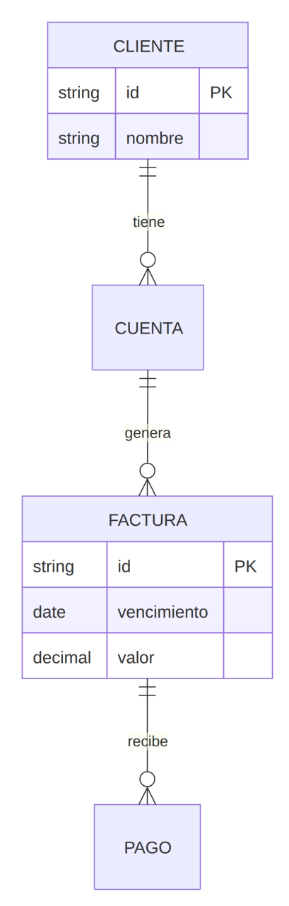

# AdvanceDrawIO

Servidor MCP para generar diagramas **draw.io de arquitectura avanzados**. El modelo describe la *estructura* en JSON y el servidor se encarga de todo lo que los LLM hacen mal:

- **Layout automático con ELK** (motor de draw.io Desktop) con zonas anidadas. El modelo nunca escribe coordenadas.
- **Iconos oficiales** a partir del índice de ~10.000 shapes de draw.io, más tus propios SVG. El modelo nunca escribe base64.
- **Estilo de tarjeta de la plantilla GCP oficial**: icono, función y producto.
- **Capas reales**: por flujo, visibles u ocultas, con una **leyenda clicable** que las muestra y oculta.
- **Pasos numerados**, **notas** en su propia capa y título.
- **Loop visual**: `build_diagram` devuelve el PNG para que el modelo revise su resultado y corrija.
- **Los 770 ejemplos oficiales de jgraph como referencia**: catálogo clasificado en 23 tipos, con la receta
  de estilos de cada ejemplo y tres modos de construcción (spec, Mermaid y plantilla).


## Requisitos

- Python 3.10+
- [draw.io Desktop](https://get.diagrams.net) (se usa su CLI para el layout y el export). En Linux sin pantalla, instala `xvfb` también.

## Instalación

```bash
git clone https://github.com/Leonsang/AdvanceDrawIO.git
cd AdvanceDrawIO
pip install -e .
advancedrawio-build examples/plataforma-ia-gcp.json   # prueba rápida -> ./diagramas/
```

La primera ejecución descarga el índice de iconos (~5 MB) y lo guarda en `~/.cache/advancedrawio`.

### Claude Code

```bash
claude mcp add advancedrawio -e ADVANCEDRAWIO_OUT=$HOME/diagramas -- advancedrawio
```

### Claude Desktop (`claude_desktop_config.json`)

```json
{
  "mcpServers": {
    "advancedrawio": {
      "command": "advancedrawio",
      "env": { "ADVANCEDRAWIO_OUT": "C:\\Users\\TU_USUARIO\\diagramas" }
    }
  }
}
```

Si `advancedrawio` no está en el PATH, usa la ruta completa del ejecutable. Por ejemplo, `.venv\Scripts\advancedrawio.exe` en Windows o `.venv/bin/advancedrawio` en macOS y Linux.

Después pide: *"usa doctor"* para verificar que encuentra draw.io y los iconos.

## Tres modos, según el tipo de diagrama

| Modo | Para | Tool |
|---|---|---|
| **spec** | Arquitectura cloud, redes, flujos, C4, pipelines | `build_diagram` |
| **mermaid** | ER, secuencia, clases, estados, gantt, mindmap, git | `build_from_mermaid` |
| **plantilla** | Planos, infografías, wireframes, DOFA/canvas, eléctricos | `build_from_example` |

| spec (stencils AWS) | mermaid (ER) | plantilla (DOFA) |
|---|---|---|
|  |  |  |

## Tools

| Tool | Para qué |
|---|---|
| `find_examples(tipo, query, patron, libreria)` | Buscar entre los 770 ejemplos de jgraph. Sin argumentos, lista los tipos |
| `get_example(id)` | Receta de estilos por rol, capas, textos reemplazables e imagen del ejemplo |
| `search_icons(query)` | Iconos GCP (imagen), para el campo `product` |
| `search_shapes(query)` | Stencils oficiales (AWS, Azure, Cisco, Kubernetes, BPMN…), para el campo `style` |
| `build_diagram(spec)` | Modo spec: layout ELK, capas, leyenda, revisión y PNG |
| `build_from_mermaid(code)` | Modo mermaid: shapes nativos y editables |
| `build_from_example(id, replacements)` | Modo plantilla: copia el ejemplo y reemplaza textos conservando el formato |
| `lint_diagram(path)` / `render(path)` | Revisión objetiva / ver un `.drawio` como PNG |
| `spec_reference()` / `doctor()` | Formato del spec / diagnóstico |

El **agente** `drawio-architect` (en `.claude/agents/`, también disponible como prompt MCP `arquitecto_drawio`)
empieza siempre buscando ejemplos del tipo pedido, elige el modo y corrige hasta pasar la revisión.

## Spec

```json
{
  "title": "Plataforma IA",
  "direction": "RIGHT",
  "layers": [{"id": "seg", "name": "Seguridad", "visible": false, "color": "#EA4335"}],
  "zones":  [{"id": "gcp", "label": "Google Cloud", "kind": "cloud"},
             {"id": "agentes", "label": "Agentes", "kind": "zone", "parent": "gcp"}],
  "nodes":  [{"id": "orq", "label": "Orquestador", "product": "Cloud Run", "zone": "agentes"}],
  "edges":  [{"from": "orq", "to": "sm", "layer": "seg", "dashed": true, "step": 1, "label": "secretos"}],
  "notes":  [{"text": "Escala a 0", "near": "orq"}]
}
```

- **Tipos de zona**: `cloud` (fondo gris, bloque del proveedor), `zone` (punteada azul), `external` (pastel, fuera de la nube) y `plain`.
- **Tipos de nodo**: `card` (tarjeta con icono, por defecto), `box`, `actor` y `database`.
- **Edges**: sin `layer` van a la capa Base. `step` pinta un badge numerado. También admiten `dashed` y `bidirectional`.
- **Capas**: con `visible: false` quedan ocultas y se activan desde la leyenda. En draw.io, haz Ctrl/Cmd + clic sobre la leyenda en modo edición, o un clic normal en el visor o lightbox.

El ejemplo completo está en [`examples/plataforma-ia-gcp.json`](examples/plataforma-ia-gcp.json).

## Iconos propios

El índice de draw.io no trae iconos recientes como **Vertex AI** o **Gemini**. Pon los SVG en `icons/` (por ejemplo, `icons/vertex-ai.svg`) o en la carpeta que indique `ADVANCEDRAWIO_ICONS`, y úsalos con `"product": "vertex ai"`. Tienen prioridad sobre el índice.

## Variables de entorno

| Variable | Default |
|---|---|
| `ADVANCEDRAWIO_OUT` | `./diagramas` |
| `DRAWIO_BIN` | autodetecta en PATH, macOS, Windows y WSL |
| `ADVANCEDRAWIO_ICONS` | `./icons` |
| `ADVANCEDRAWIO_CACHE` | `~/.cache/advancedrawio` |

## Limitaciones conocidas

- ELK optimiza el flujo, no la estética. En arquitecturas con muchos cruces entre zonas, un retoque manual de 1–2 minutos suele hacer falta.
- No uses `--layout libavoid` en modo headless, porque se cuelga.
- Por encima de ~25 nodos conviene partir el sistema en varios diagramas.

## Actualizar el catálogo de ejemplos

`src/advancedrawio/catalog.json` se genera desde los repos de jgraph. Las instrucciones están en
`scripts/build_catalog.py`. Los ejemplos se descargan bajo demanda y se guardan en cache.

## Desarrollo

```bash
pip install -e ".[dev]" && pytest
```
