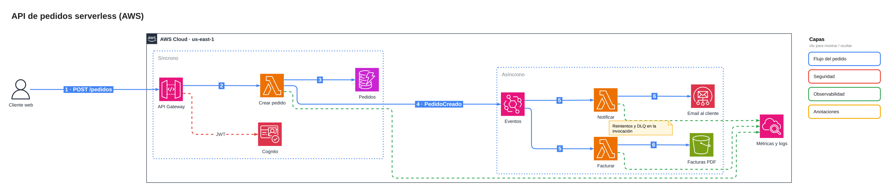
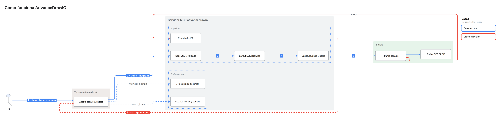
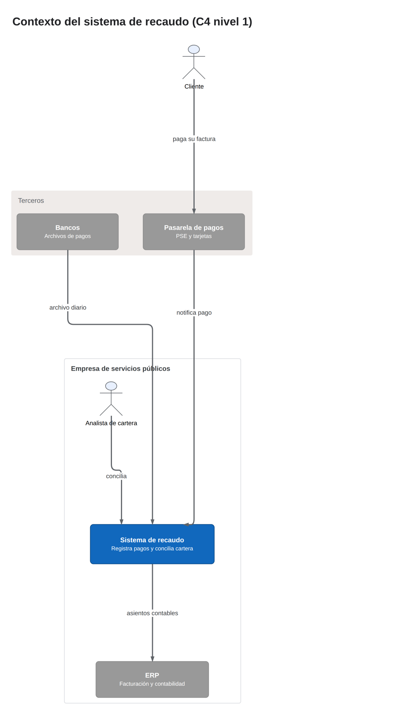
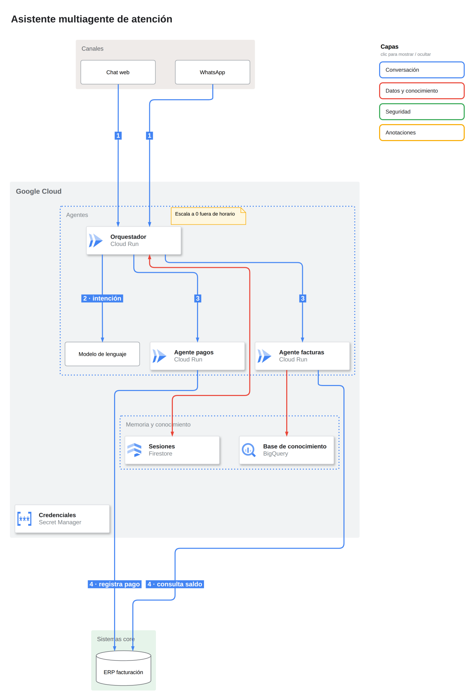
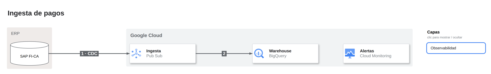
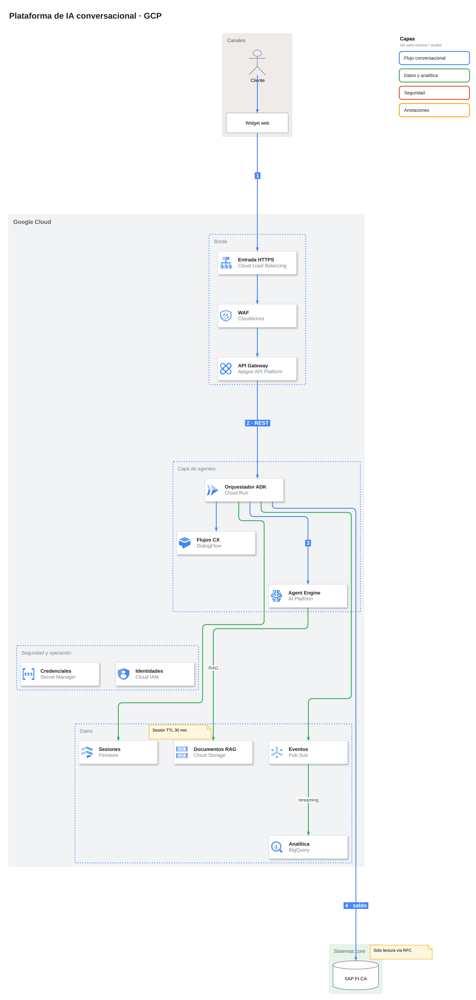
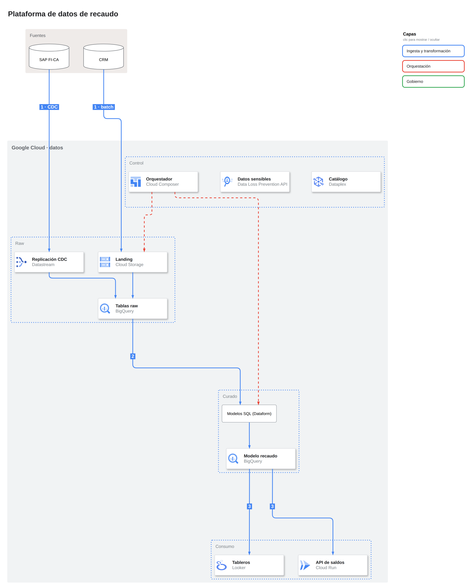
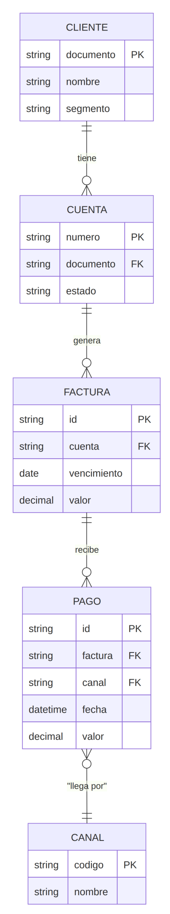
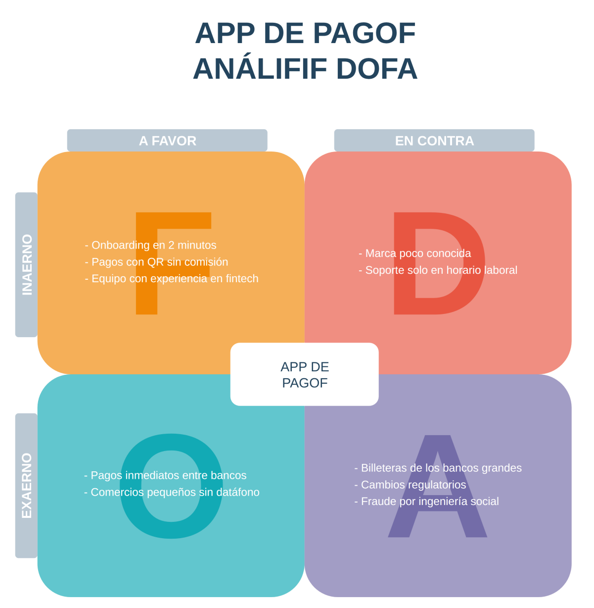

# Galería

Generada por `scripts/galeria.py` a partir de [`examples/`](../../examples). No la edites a mano:
el workflow **galería** la regenera.

| Ejemplo | Modo | Nodos | Revisión | Abrir |
|---|---|---|---|---|
| [API de pedidos serverless (AWS)](../../examples/aws-serverless.json) | spec | 11 | 80 · proporcion_extrema | [draw.io](https://app.diagrams.net/#Uhttps://raw.githubusercontent.com/Leonsang/AdvanceDrawIO/main/docs/galeria/aws-serverless.drawio) |
| [Cómo funciona AdvanceDrawIO](../../examples/como-funciona.json) | spec | 10 | 100 · sin problemas | [draw.io](https://app.diagrams.net/#Uhttps://raw.githubusercontent.com/Leonsang/AdvanceDrawIO/main/docs/galeria/como-funciona.drawio) |
| [Contexto del sistema de recaudo (C4 nivel 1)](../../examples/contexto-c4.json) | spec | 6 | 100 · sin problemas | [draw.io](https://app.diagrams.net/#Uhttps://raw.githubusercontent.com/Leonsang/AdvanceDrawIO/main/docs/galeria/contexto-c4.drawio) |
| [Asistente multiagente de atención](../../examples/multiagente-gcp.json) | spec | 10 | 100 · sin problemas | [draw.io](https://app.diagrams.net/#Uhttps://raw.githubusercontent.com/Leonsang/AdvanceDrawIO/main/docs/galeria/multiagente-gcp.drawio) |
| [Ingesta de pagos](../../examples/pipeline-datos.json) | spec | 4 | 100 · sin problemas | [draw.io](https://app.diagrams.net/#Uhttps://raw.githubusercontent.com/Leonsang/AdvanceDrawIO/main/docs/galeria/pipeline-datos.drawio) |
| [Plataforma de IA conversacional · GCP](../../examples/plataforma-ia-gcp.json) | spec | 15 | 100 · sin problemas | [draw.io](https://app.diagrams.net/#Uhttps://raw.githubusercontent.com/Leonsang/AdvanceDrawIO/main/docs/galeria/plataforma-ia-gcp.drawio) |
| [Plataforma de datos de recaudo](../../examples/plataforma-recaudo.json) | spec | 12 | 100 · sin problemas | [draw.io](https://app.diagrams.net/#Uhttps://raw.githubusercontent.com/Leonsang/AdvanceDrawIO/main/docs/galeria/plataforma-recaudo.drawio) |
| [Modelo de datos de recaudo](../../examples/modelo-recaudo.mmd) | mermaid | 5 | 100 · sin problemas | [draw.io](https://app.diagrams.net/#Uhttps://raw.githubusercontent.com/Leonsang/AdvanceDrawIO/main/docs/galeria/modelo-recaudo.drawio) |
| [DOFA de una app de pagos](../../examples/dofa-app-pagos.plantilla.json) | plantilla | 21 | no aplica (diseño del ejemplo) | [draw.io](https://app.diagrams.net/#Uhttps://raw.githubusercontent.com/Leonsang/AdvanceDrawIO/main/docs/galeria/dofa-app-pagos.drawio) |

## API de pedidos serverless (AWS)

## Cómo funciona AdvanceDrawIO

## Contexto del sistema de recaudo (C4 nivel 1)

## Asistente multiagente de atención

## Ingesta de pagos

## Plataforma de IA conversacional · GCP

## Plataforma de datos de recaudo

## Modelo de datos de recaudo

## DOFA de una app de pagos

