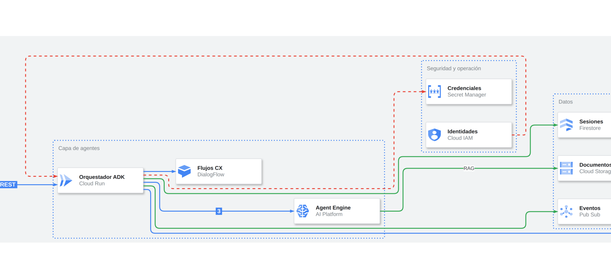

# Referencia del spec

El spec es un JSON que describe **qué hay y cómo se conecta**. No lleva coordenadas, tamaños de
página ni XML: el servidor calcula el layout con ELK, pone los estilos y los iconos, crea las capas
y dibuja la leyenda. Es lo que recibe la tool `build_diagram` y el CLI `advancedrawio-build`.

```json
{
  "title": "Plataforma IA",
  "direction": "RIGHT",
  "spacing": 40,
  "legend": true,
  "layers": [{"id": "seg", "name": "Seguridad", "visible": false, "color": "#EA4335"}],
  "zones":  [{"id": "gcp", "label": "Google Cloud", "kind": "cloud"},
             {"id": "agentes", "label": "Agentes", "kind": "zone", "parent": "gcp"}],
  "nodes":  [{"id": "orq", "label": "Orquestador", "product": "Cloud Run", "zone": "agentes"}],
  "edges":  [{"from": "orq", "to": "sm", "layer": "seg", "dashed": true, "step": 1, "label": "secretos"}],
  "notes":  [{"text": "Escala a 0", "near": "orq"}]
}
```

## Raíz

| Campo | Tipo | Default | Qué hace |
|---|---|---|---|
| `title` | string | — | Título grande arriba a la izquierda. También nombra la página del `.drawio`. |
| `direction` | `RIGHT` \| `DOWN` | `RIGHT` | Sentido del flujo para ELK. `RIGHT` para flujos cortos, `DOWN` para cadenas largas. |
| `spacing` | int | `40` | Separación entre nodos. Entre capas de ELK se usa `spacing × 1.8`. |
| `legend` | bool | `true` | Dibuja la leyenda clicable si hay capas o notas. |

## `zones`

Contenedores anidables. ELK acomoda su contenido y los redimensiona.

| Campo | Default | Qué hace |
|---|---|---|
| `id` | obligatorio | Único entre zonas y nodos. |
| `label` | `""` | Texto arriba a la izquierda de la zona. |
| `kind` | `zone` | `cloud` (fondo gris, bloque del proveedor), `zone` (punteada azul, capa lógica), `external` (pastel, fuera de la nube) o `plain` (borde gris). |
| `parent` | — | `id` de otra zona. Se puede anidar a cualquier profundidad. |
| `style` | — | Style draw.io libre, por ejemplo el grupo `AWS Cloud` de `search_shapes`. Reemplaza el de `kind`. |

## `nodes`

| Campo | Default | Qué hace |
|---|---|---|
| `id` | obligatorio | Único. Es lo que usan `edges` y `notes`. |
| `label` | el `id` | La **función de negocio** ("Orquestador", "Sesiones"). Admite HTML simple. |
| `product` | — | El **servicio** ("Cloud Run"). Pone el icono y un subtítulo gris. Usa el título exacto de `search_icons`. |
| `kind` | `card` | `card` (tarjeta con icono), `box`, `actor` o `database`. |
| `zone` | — | `id` de la zona que lo contiene. Sin zona, va suelto en el lienzo. |
| `style` | — | Style draw.io libre (stencils de `search_shapes` o recetas de `get_example`). En un style, `image=<icono>` se reemplaza por el icono de `product`. |
| `w`, `h` | según `kind` | Tamaño. `card` 190×56, `box` 150×48, `actor` 40×60, `database` 110×70. |

## `edges`

| Campo | Default | Qué hace |
|---|---|---|
| `from`, `to` | obligatorios | `id` de nodos o zonas. |
| `label` | — | Protocolo o dato. Ponlo solo si aporta. |
| `layer` | Base | `id` de una capa de `layers`. Sin capa, el edge va a la capa Base. |
| `step` | — | Número del paso: pinta un badge con el color de la capa. |
| `dashed` | `false` | Línea discontinua (dependencias, control, flujos secundarios). |
| `bidirectional` | `false` | Flecha en ambos extremos. |
| `style` | — | Style draw.io libre. |

El edge se crea dentro del contenedor común más interno de sus extremos. Así ELK lo enruta dentro
de la zona correcta. Después se mueve a su capa con los waypoints en coordenadas absolutas.

## `layers`

| Campo | Default | Qué hace |
|---|---|---|
| `id` | obligatorio | Lo referencian los `edges`. |
| `name` | el `id` | Nombre en draw.io y en la leyenda. |
| `visible` | `true` | Con `false`, la capa arranca oculta y se muestra desde la leyenda. |
| `color` | paleta | Color de sus edges y de su botón en la leyenda. |

La leyenda usa acciones `data:action/json` de draw.io. En el editor se activan con **Ctrl/Cmd + clic**;
en el visor, el lightbox o un `.drawio` embebido, con un clic normal.



## `notes`

`{"text": "SLA 99.9%", "near": "bq"}` pone una nota adhesiva arriba a la derecha de un nodo o zona,
en su propia capa **Anotaciones** (que también aparece en la leyenda).

## Validación

Antes de dibujar, el spec se valida y **todos** los errores se devuelven juntos, para que el modelo
los corrija en una sola vuelta: ids duplicados, zonas o nodos que no existen, capas no declaradas,
`kind` inválido o un spec sin nodos.
